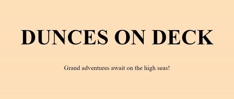

# Dunces on Deck

Dunces on Deck is a collaborative storytelling game for 3-6 players, created with Web Speech, PeerJS, and the GIPHY API. Players connect to a host computer using their phones. Players then fill out prompts which are placed into a template and read out by a text-to-speech narrator.

Trailer - https://www.youtube.com/watch?v=3GE8cPtALoI

## Assets Used

- [Ireland's Coast (Travelog Edition - LIVE PLAYERS) by Matthew Pablo (CC-BY 3.0)](https://opengameart.org/content/irelands-coast-travelog-edition-live-players)
- [Blackmoor Tides (Epic Pirate Battle Theme) by Matthew Pablo (CC-BY 3.0)](https://opengameart.org/content/blackmoor-tides-epic-pirate-battle-theme)
- [Beyond The Clouds (Orchestral Theme) by Matthew Pablo (CC-BY 3.0)](https://opengameart.org/content/beyond-the-clouds-orchestral-theme)
- [Brean Sands Beach by richwise (CC0)](https://freesound.org/people/richwise/sounds/475350/)
